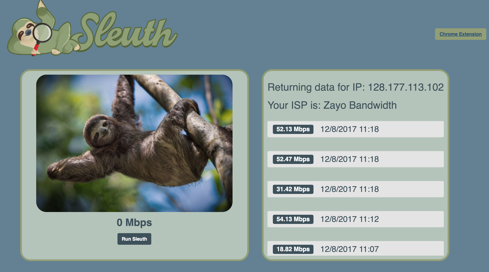
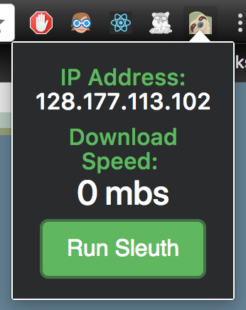

# Sleuth
Sleuth is an app designed to create an even playing field for all ISPs. When using the app, you can check your download speed and compare top download speeds amongst other ISPs.
#### Deployed site
[Click here to visit the deployed site](https://speed-sleuth.firebaseapp.com)
#### Chrome Extension
[Click here to download the Chrome Extension](https://chrome.google.com/webstore/detail/sleuth/ljcgfcpjeioeodhbpjjfamlikpgmnhno/related?hl=en)

## Screenshots

## To run locally:
1. Fork and clone the repo
2. In command line, `git clone {insert-your-repo-SSH-key}`
3. Run `npm install`
4. Run `brew install yarn`
5. In order to view on your local host, run `yarn start` (or `npm start` if yarn doesn't work)

## How to contribute
1. Fork and clone this repo
2. Check the list of needs for what changes can be added
3. Create a pull request and an admin will give you feedback
4. Celebrate

## List of needs
##### TBD

##### If you have a great feature that you'd like to see on Sleuth, send one of our admins a message!

Feel free to check with admins to see what projects are currently underway.

### Admins
1. [Luke Romberg](https://github.com/lukeromberg)
2. [Kelsey Laver](https://github.com/kalaver8)
3. [Dave Francese](https://github.com/davefrancese)
4. [Jordan Reed](https://github.com/jordanreed23)
5. [Kyle Gibson](https://github.com/kylegibson15)
6. [Jake Robbins](https://github.com/iamjakerobbins)
7. [Tito Yslas](https://github.com/tyslas)
8. [Mike Williams](https://github.com/willofmike)
9. [Geralle Estes](https://github.com/geralle)

### Contributors
1. [Paul Rodriguez](https://github.com/prdesignwork)
2. [Lizz Robbins](https://github.com/lizzrobbins)
